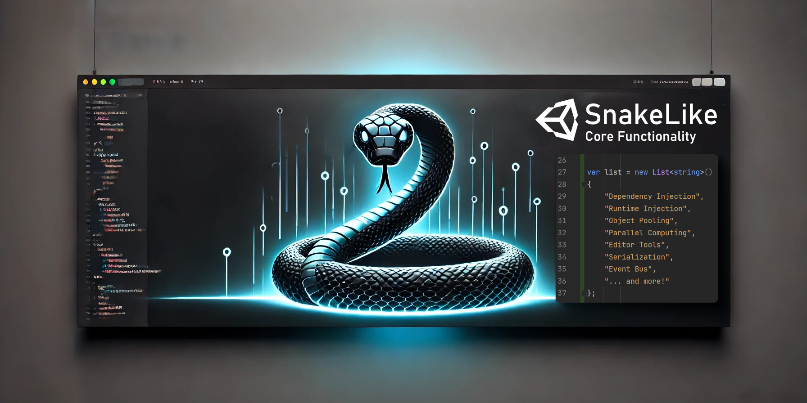

# Portfolio: Game Development / XR Development

Context: Born Aviation
Created time: July 20, 2024 6:09 PM

## 1. Project: Missing

Missing is a VR game I contributed to during my time at Born. It is a puzzle-solving, mystery, and adventure game that tells the poignant story of a lady with dementia trying to find her way. The game combines immersive storytelling with challenging puzzles, providing a unique and engaging experience for players.

Missing is available on AppLab
↗️ [https://www.meta.com/experiences/7078135438974343/](https://www.meta.com/experiences/7078135438974343/)

## 2. Bottling Machine Lockout Procedure VR Training

This is the promo video for a VR training application on the lockout procedure for a bottling machine, in whose development I was actively involved. The application is meant to be used by technicians to learn a hard-skill faster and with more confidence.

### Walkthrough

## 3. VR Training Application for Aircraft Electrical System Maintainance

This VR Training Application offers a detailed walkthrough for the maintenance of aircraft electrical systems. Designed as a multiplayer application, it allows multiple users to engage simultaneously, creating a collaborative learning environment. Developed during my tenure at Born, this application provides an immersive and interactive platform for technicians to master essential maintenance procedures, ensuring they are well-prepared for real-world scenarios.

### Walkthrough

## 4. VR Hard-Skill Training for Seatbelt Assembly

This VR application, developed during my tenure at Born Immersive, is a specialized training tool designed to teach technicians the maintenance procedures for seatbelts in passenger aircraft. It provides an immersive, hands-on learning experience for hard-skill training.

### Promo

### Walkthrough

## 5. Virtual Real Estate VR Application

Virtual Real Estate is a VR application designed to showcase the potential of virtual reality for real estate presentations. I contributed to this project during my tenure at Born, collaborating with a team to create immersive virtual tours that enhance the way potential buyers explore properties.

### Promo

## 6. Rainbow Bridge VR

Rainbow Bridge VR is an immersive virtual reality experience that I developed at Koç University's Karma Mixed Reality Lab. Directed and designed by Seher Kış, with voice work by Nil İpek, this application was showcased at VR Days Europe.

In Rainbow Bridge VR, I created a serene and comforting virtual space inspired by the "Rainbow Bridge" poem, which provides solace to those grieving the loss of a pet. Users can explore beautiful, interactive landscapes that help them reflect and cherish the memories of their beloved pets. This project combines emotional storytelling with advanced VR technology to offer a deeply engaging and supportive experience.

### Walkthrough

## 7. Hofdes - Holographic Debrief System

I contributed to the development of this advanced VR project at Havelsan, designed for F16 pilots in the Turkish Army. The application uses holographic MR and Hololens technology to provide a collaborative environment for flight debriefing. Due to its military-grade nature, I am unable to share further details.

## 8. WarTable - Holographic War Table

I contributed to the development of this Hololens application at Havelsan, designed for ground forces to plan and simulate battles. The application features a detailed 3D topological map where users can strategically place army units and simulate combat scenarios. This project provides an advanced tool for strategic planning and operational training, leveraging the capabilities of mixed reality to enhance military preparedness. Due to its military-grade nature, further details cannot be disclosed.

## 9. SnakeCore Unity Package

SnakeCore is a Unity codebase I developed to enhance software engineering quality in Unity projects. Drawing from the knowledge I gained at Born, I created this package to provide a basic and extendable framework that facilitates dependency injection, serialization, ini-based configurations, and event bus communications. SnakeCore simplifies common tasks, enabling cleaner, more maintainable, and scalable project structures. I developed this package to contribute to the open-source community and will continue to extend it with more utilities and tools.

↗️ [**OpenUPM**](https://openupm.com/packages/com.snakelikecoding.snakecore/)

↗️ [GitHub](https://github.com/tahameg/SnakeCore)
